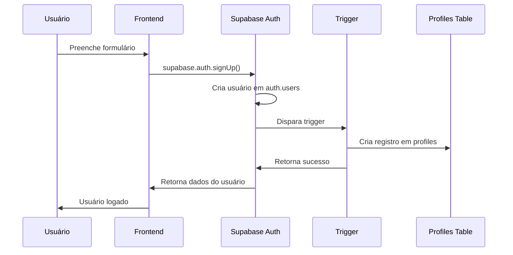
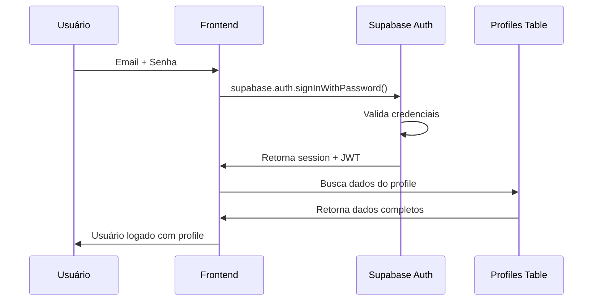

# DOCUMENTAÇÃO TÉCNICA - SISTEMA DE AUTENTICAÇÃO e-volua

## 📋 Índice
1. [Visão Geral](#visão-geral)
2. [Arquitetura](#arquitetura)
3. [Esquema do Banco](#esquema-do-banco)
4. [Fluxo de Autenticação](#fluxo-de-autenticação)
5. [Configuração](#configuração)
6. [Troubleshooting](#troubleshooting)
7. [Modelo para Replicação](#modelo-para-replicação)

## 🎯 Visão Geral

O sistema de autenticação do e-volua utiliza **Supabase Auth** integrado com uma tabela customizada de profiles, implementando:

- ✅ Autenticação via email/senha
- ✅ Criação automática de profiles
- ✅ Sistema de roles (aluno, professor, admin)
- ✅ Row Level Security (RLS)
- ✅ Triggers automáticos
- ✅ Fallbacks robustos

## 🏗️ Arquitetura

```
┌─────────────────┐    ┌─────────────────┐    ┌─────────────────┐
│   Frontend      │    │   Supabase      │    │   Database      │
│   (React)       │────│   Auth          │────│   Tables        │
│                 │    │                 │    │                 │
│ - AuthProvider  │    │ - JWT Tokens    │    │ - auth.users    │
│ - AuthContext   │    │ - Sessions      │    │ - profiles      │
│ - useAuth       │    │ - Middleware    │    │ - triggers      │
└─────────────────┘    └─────────────────┘    └─────────────────┘
```

## 🗄️ Esquema do Banco

### Tabela `auth.users` (Supabase gerenciado)
- `id` (UUID, PK)
- `email` (TEXT)
- `encrypted_password` (TEXT)
- `email_confirmed_at` (TIMESTAMPTZ)
- `raw_user_meta_data` (JSONB)
- `created_at` (TIMESTAMPTZ)
- `updated_at` (TIMESTAMPTZ)

### Tabela `public.profiles` (Customizada)
```sql
CREATE TABLE public.profiles (
    id UUID PRIMARY KEY,                    -- FK para auth.users.id
    email TEXT NOT NULL DEFAULT '',        -- Email do usuário
    full_name TEXT DEFAULT '',             -- Nome completo
    nome TEXT DEFAULT '',                  -- Campo legado (pode ser removido)
    categoria TEXT DEFAULT 'aluno',        -- Categoria do usuário
    papel TEXT DEFAULT 'aluno',            -- Papel/role do usuário
    whatsapp TEXT,                         -- WhatsApp opcional
    cidade TEXT,                           -- Cidade opcional
    estado TEXT,                           -- Estado opcional
    instituicao TEXT,                      -- Instituição opcional
    registro_profissional TEXT,            -- Registro profissional opcional
    created_at TIMESTAMPTZ DEFAULT NOW(), -- Data de criação
    updated_at TIMESTAMPTZ DEFAULT NOW()  -- Data de atualização
);
```

## 🔄 Fluxo de Autenticação

### 1. Cadastro de Usuário


### 2. Login de Usuário


## ⚙️ Configuração

### 1. Políticas RLS
```sql
-- Política permissiva para usuários autenticados
CREATE POLICY "allow_all_authenticated_users" ON public.profiles 
    FOR ALL 
    USING (auth.role() = 'authenticated') 
    WITH CHECK (auth.role() = 'authenticated');
```

### 2. Trigger de Criação Automática
```sql
CREATE OR REPLACE FUNCTION public.handle_new_user_robust()
RETURNS TRIGGER AS $$
DECLARE
    user_name TEXT;
    user_email TEXT;
BEGIN
    -- Extrair dados com fallbacks seguros
    user_email := COALESCE(NEW.email, '');
    user_name := COALESCE(
        NEW.raw_user_meta_data->>'full_name',
        NEW.raw_user_meta_data->>'nome',
        NEW.raw_user_meta_data->>'name',
        SPLIT_PART(user_email, '@', 1),
        'Usuário'
    );

    -- Inserir profile com ON CONFLICT
    INSERT INTO public.profiles (
        id, email, full_name, nome, categoria, papel, created_at, updated_at
    ) VALUES (
        NEW.id, user_email, user_name, user_name, 'aluno', 'aluno', NOW(), NOW()
    ) ON CONFLICT (id) DO UPDATE SET
        email = EXCLUDED.email,
        updated_at = NOW();

    RETURN NEW;
EXCEPTION
    WHEN OTHERS THEN
        RAISE WARNING 'Erro ao criar profile: %', SQLERRM;
        RETURN NEW;
END;
$$ LANGUAGE plpgsql SECURITY DEFINER;

CREATE TRIGGER on_auth_user_created_robust
    AFTER INSERT ON auth.users
    FOR EACH ROW 
    EXECUTE FUNCTION public.handle_new_user_robust();
```

### 3. Frontend (React)
```typescript
// AuthProvider.tsx
const signUp = async (data: RegisterData) => {
  // 1. Criar usuário no Supabase Auth
  const { data: authData, error: authError } = await supabase.auth.signUp({
    email: data.email,
    password: data.password
  });

  if (authError) throw authError;

  // 2. O trigger automaticamente cria o profile
  // 3. Opcional: atualizar dados adicionais do profile
  if (authData.user) {
    await supabase
      .from('profiles')
      .update({
        full_name: data.nome,
        nome: data.nome,
        whatsapp: data.whatsapp,
        cidade: data.cidade,
        estado: data.estado
      })
      .eq('id', authData.user.id);
  }
};
```

## 🚨 Troubleshooting

### Problemas Comuns

#### 1. Erro "null value violates not-null constraint"
**Causa:** Coluna com NOT NULL sem valor padrão
**Solução:**
```sql
ALTER TABLE profiles ALTER COLUMN nome DROP NOT NULL;
ALTER TABLE profiles ALTER COLUMN nome SET DEFAULT '';
```

#### 2. Trigger não executa
**Causa:** Trigger desabilitado ou função com erro
**Solução:**
```sql
-- Verificar triggers
SELECT * FROM pg_trigger WHERE tgrelid = 'auth.users'::regclass;

-- Recriar trigger
DROP TRIGGER IF EXISTS on_auth_user_created_robust ON auth.users;
CREATE TRIGGER on_auth_user_created_robust
    AFTER INSERT ON auth.users
    FOR EACH ROW 
    EXECUTE FUNCTION public.handle_new_user_robust();
```

#### 3. RLS bloqueando inserções
**Causa:** Políticas muito restritivas
**Solução:**
```sql
-- Política permissiva para desenvolvimento
CREATE POLICY "allow_all_authenticated" ON profiles 
    FOR ALL USING (auth.role() = 'authenticated');
```

### Comandos de Diagnóstico
```sql
-- 1. Verificar estrutura
SELECT column_name, is_nullable, column_default 
FROM information_schema.columns 
WHERE table_name = 'profiles';

-- 2. Verificar triggers
SELECT tgname, tgenabled 
FROM pg_trigger 
WHERE tgrelid = 'auth.users'::regclass;

-- 3. Verificar políticas
SELECT policyname, cmd, qual 
FROM pg_policies 
WHERE tablename = 'profiles';

-- 4. Verificar dados
SELECT COUNT(*) FROM auth.users;
SELECT COUNT(*) FROM profiles;
```

## 🔄 Modelo para Replicação

### Passo a Passo para Novos Projetos

#### 1. Configuração Inicial do Supabase
```sql
-- 1.1 Criar tabela de profiles
CREATE TABLE public.profiles (
    id UUID PRIMARY KEY,
    email TEXT NOT NULL DEFAULT '',
    full_name TEXT DEFAULT '',
    role TEXT DEFAULT 'user',
    created_at TIMESTAMPTZ DEFAULT NOW(),
    updated_at TIMESTAMPTZ DEFAULT NOW()
);

-- 1.2 Configurar RLS
ALTER TABLE public.profiles ENABLE ROW LEVEL SECURITY;

CREATE POLICY "users_can_manage_own_profile" ON public.profiles 
    FOR ALL USING (auth.uid() = id);
```

#### 2. Trigger de Criação Automática
```sql
CREATE OR REPLACE FUNCTION public.handle_new_user()
RETURNS TRIGGER AS $$
BEGIN
    INSERT INTO public.profiles (id, email, full_name, created_at, updated_at)
    VALUES (
        NEW.id,
        NEW.email,
        COALESCE(NEW.raw_user_meta_data->>'full_name', 'User'),
        NOW(),
        NOW()
    );
    RETURN NEW;
EXCEPTION
    WHEN OTHERS THEN
        RETURN NEW;
END;
$$ LANGUAGE plpgsql SECURITY DEFINER;

CREATE TRIGGER on_auth_user_created
    AFTER INSERT ON auth.users
    FOR EACH ROW 
    EXECUTE FUNCTION public.handle_new_user();
```

#### 3. Frontend React
```typescript
// contexts/AuthProvider.tsx
import { createContext, useContext, useEffect, useState } from 'react'
import { supabase } from '../lib/supabase'

interface User {
  id: string
  email: string
  full_name: string
  role: string
}

interface AuthContextType {
  user: User | null
  signIn: (email: string, password: string) => Promise<void>
  signUp: (email: string, password: string, full_name: string) => Promise<void>
  signOut: () => Promise<void>
}

const AuthContext = createContext<AuthContextType | null>(null)

export const AuthProvider = ({ children }) => {
  const [user, setUser] = useState<User | null>(null)

  const signUp = async (email: string, password: string, full_name: string) => {
    const { error } = await supabase.auth.signUp({
      email,
      password,
      options: {
        data: { full_name }
      }
    })
    if (error) throw error
  }

  const signIn = async (email: string, password: string) => {
    const { error } = await supabase.auth.signInWithPassword({
      email,
      password
    })
    if (error) throw error
  }

  const signOut = async () => {
    await supabase.auth.signOut()
    setUser(null)
  }

  return (
    <AuthContext.Provider value={{ user, signIn, signUp, signOut }}>
      {children}
    </AuthContext.Provider>
  )
}

export const useAuth = () => {
  const context = useContext(AuthContext)
  if (!context) throw new Error('useAuth must be used within AuthProvider')
  return context
}
```

## ✅ Checklist de Implementação

### Banco de Dados
- [ ] Tabela `profiles` criada
- [ ] Políticas RLS configuradas
- [ ] Trigger de criação automática implementado
- [ ] Função trigger testada
- [ ] Dados existentes migrados

### Frontend
- [ ] AuthProvider implementado
- [ ] useAuth hook criado
- [ ] Páginas de login/register criadas
- [ ] Proteção de rotas implementada
- [ ] Tratamento de erros configurado

### Testes
- [ ] Cadastro de novo usuário
- [ ] Login de usuário existente
- [ ] Logout funcional
- [ ] Criação automática de profile
- [ ] Políticas RLS funcionando

## 🔐 Segurança

### Boas Práticas
1. **RLS sempre habilitado** em tabelas sensíveis
2. **Políticas específicas** por funcionalidade
3. **Triggers com tratamento de erro** para não quebrar auth
4. **Validação no frontend e backend**
5. **Logs de erros** para monitoramento

### Políticas Recomendadas
```sql
-- Leitura: usuário pode ver próprio profile
CREATE POLICY "users_read_own_profile" ON profiles 
    FOR SELECT USING (auth.uid() = id);

-- Escrita: usuário pode editar próprio profile
CREATE POLICY "users_update_own_profile" ON profiles 
    FOR UPDATE USING (auth.uid() = id);

-- Admin: pode ver todos os profiles
CREATE POLICY "admins_read_all_profiles" ON profiles 
    FOR SELECT USING (
        EXISTS (
            SELECT 1 FROM profiles 
            WHERE id = auth.uid() AND role = 'admin'
        )
    );
```

---

**📝 Nota:** Esta documentação serve como base para implementação robusta de autenticação em projetos Supabase + React.
